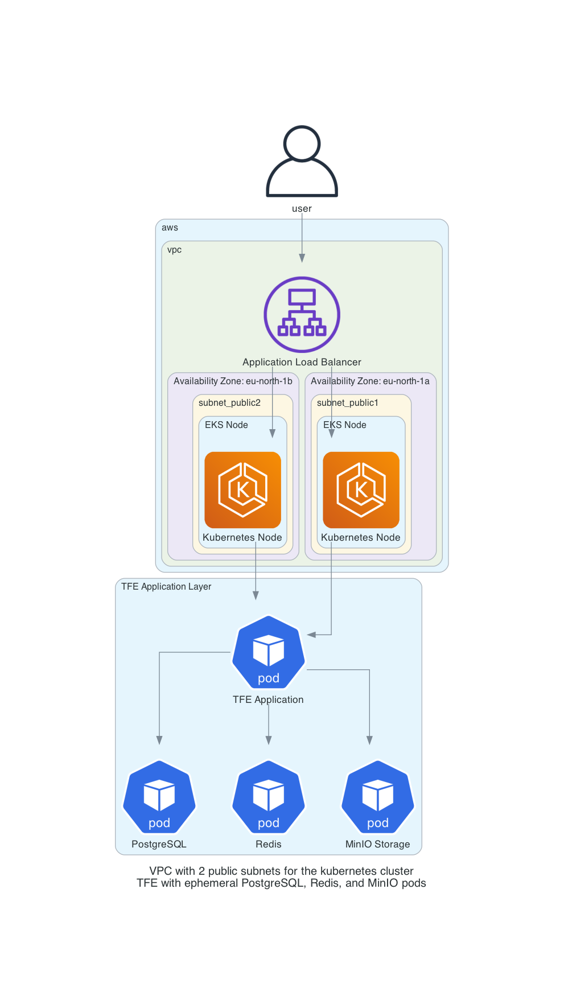

# Creating a TFE external installation on Kubernetes

With this repository you will install a Terraform Enterprise environment on a AWS Kubernetes cluster using Terraform. This implementation uses a modular approach with `for_each` to support multiple TFE instances and uses ephemeral pods for PostgreSQL, Redis and MinIO storage.

# Architecture

We create the infrastructure according to the following diagram for the kubernetes environment
  


# Prerequisites
## AWS
We will be using AWS. Make sure you have the following

AWS account
## Install terraform  
See the following documentation [How to install Terraform](https://learn.hashicorp.com/tutorials/terraform/install-cli)

## kubectl

Make sure kubectl is available on your system. Please see the documentation [here](https://kubernetes.io/docs/tasks/tools/).
## helm

Make sure helm is available on your system. Please see the documentation [here](https://helm.sh/docs/intro/install/)

# How to

- Clone this repository
```
https://github.com/munnep/tfe_fdo_aws_external_kubernetes
```
- Set your AWS credentials
```
export AWS_ACCESS_KEY_ID=
export AWS_SECRET_ACCESS_KEY=
export AWS_SESSION_TOKEN=
```
- Go into the directory `tfe_fdo_aws_external_kubernetes/infra`
```
cd tfe_fdo_aws_external_kubernetes/infra
```
- Create a file called `variables.auto.tfvars` with the following contents
```
tag_prefix                 = "tfe70"                    # Prefix used for creating tags and names in AWS                               
region                     = "eu-north-1"               # Region to create the kubernetes environment
vpc_cidr                   = "10.114.0.0/16"            # Network for the VPC to be created
k8s_min_size               = 1                          # autoscaling group minimal size.
k8s_desired_size           = 1                          # autoscaling group desired capacity.
k8s_max_size               = 2                          # autoscaling group maximum size.
```
- Initialize terraform
```
terraform init
```
- Create the AWS resources
```
terraform apply
```
- The output should be the following
```
Apply complete! Resources: 28 added, 0 changed, 0 destroyed.

Outputs:

cluster-name = "tfe70-cluster"
kubectl_environment = "aws eks update-kubeconfig --region eu-north-1 --name tfe70-cluster"
```
- The kubernetes environment is created from an infrastructure standpoint. Now you will need to deploy Terraform Enterprise on to this cluster

## TFE Pod-Only Implementation

This implementation deploys TFE using Kubernetes pods with ephemeral storage for development and testing purposes.

- Go to the directory `../tfe_pod_only`
```
cd ../tfe_pod_only
```
- Create a file called `variables.auto.tfvars` with the following contents
```
# Global TFE Configuration (shared across all instances)
tfe_license = "<your_tfe_license_raw_text>"                           # Your TFE license in raw text
certificate_email       = "patrick.munne@hashicorp.com"               # Email address used for creating valid certificates
dns_zonename            = "aws.munnep.com"                            # DNS zone where hostname records can be created
tfe_encryption_password = "<password>"                                # Encryption key used by TFE

# TFE Instances Configuration (supports multiple instances)
tfe_instances = {
  "tfe71" = {
    tag_prefix    = "tfe71"                                           # Prefix used for creating tags and names
    dns_hostname  = "tfe71"                                           # Hostname used for TFE
    replica_count = 1                                                 # Number of replicas for TFE
    tfe_release   = "1.0.1"                                           # The version of TFE application you wish to deploy
  }
  # Add more instances as needed:
  # "tfe72" = {
  #   tag_prefix    = "tfe72"
  #   dns_hostname  = "tfe72"
  #   replica_count = 1
  #   tfe_release   = "1.0.0"
  # }
}
```
- Initialize the environment
```
terraform init
```
- Create the environment
```
terraform apply
```
- The output will show information for all configured instances:
```
Apply complete! Resources: 16 added, 0 changed, 0 destroyed.

Outputs:

tfe_instances_info = {
  "tfe71" = {
    "execute_script_to_create_user_admin" = "./configure_tfe.sh tfe71.aws.munnep.com patrick.munne@hashicorp.com Password#1"
    "minio_endpoint" = "http://tfe71-minio.terraform-enterprise.svc.cluster.local:9000"
    "minio_service_name" = "tfe71-minio"
    "postgres_endpoint" = "postgres.terraform-enterprise.svc.cluster.local:5432"
    "postgres_service_name" = "tfe71-postgres"
    "tfe_application_url" = "https://tfe71.aws.munnep.com"
  }
}
```

### Configure TFE Admin User

- Execute the configuration script for your primary instance:
```
./configure_tfe.sh tfe71.aws.munnep.com patrick.munne@hashicorp.com Password#1
```
This script will:
  - Create a user called admin with the specified password
  - Create an organization called test
- Login to the application  
